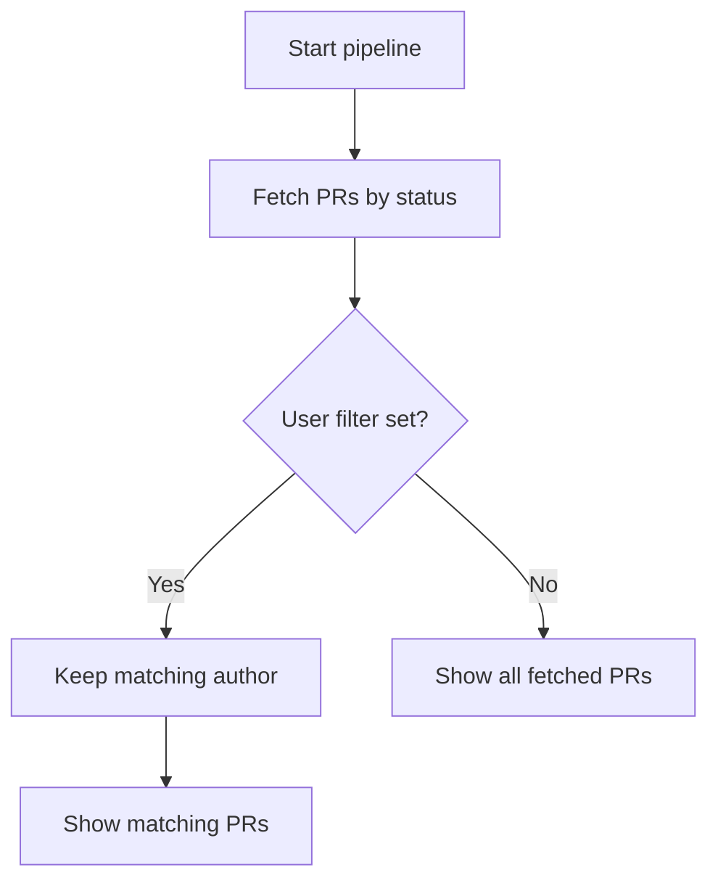
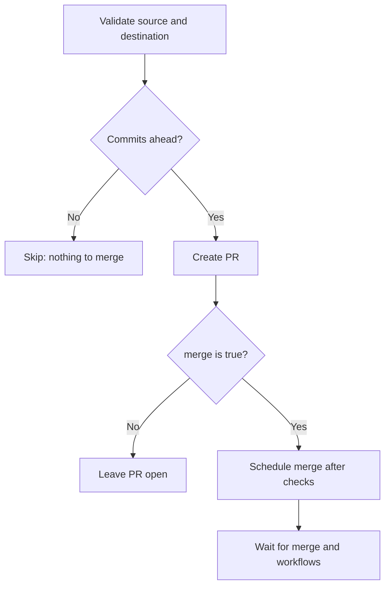
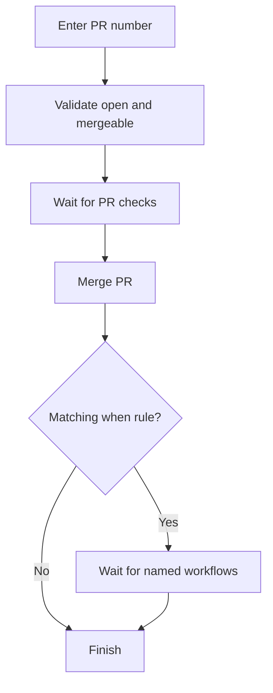
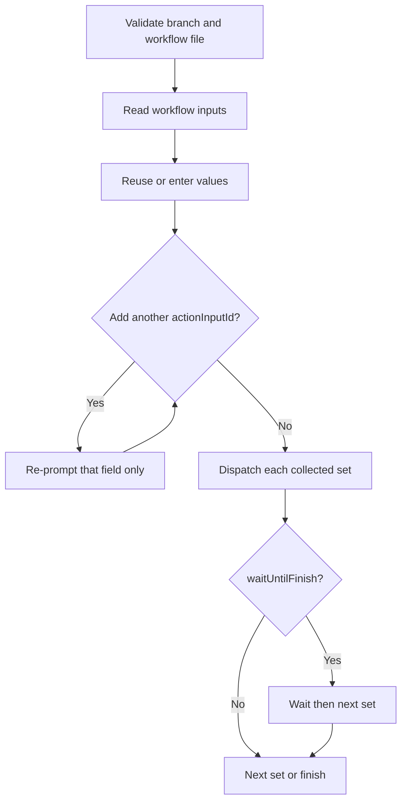
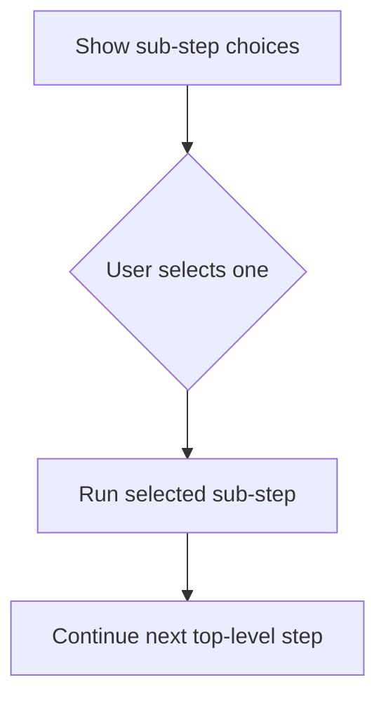

# gitrung

**gitrung** is an interactive release helper for GitHub and Gitea. Describe a repository’s pull-request and workflow actions in JSONC, then run them in a guided order.

A release often means doing the same tedious sequence by hand:

1. Create a PR from a feature branch to `develop`, then wait for it to merge.
2. Wait for the Docker image build.
3. Deploy the image to the test environment.
4. Create a PR from `develop` to `main`, then wait for it to merge.
5. Wait for the Docker image build again.
6. Deploy the image to production.

Doing that manually is boring. gitrung makes the release flow declarative, repeatable, and guided.

| Tool | What it does |
| --- | --- |
| `list-pr` | Lists pull requests, optionally limited to one author. |
| `create-pr` | Creates a pull request and can merge it after checks pass. |
| `merge-pr` | Merges an existing pull request after its checks pass. |
| `run-workflow` | Dispatches a repository workflow on a selected branch. |

## Full example

```jsonc
{
  "url": "https://github.com/acme/storefront",
  "gitPlatform": "github",
  "steps": [
    {
      "type": "create-pr",
      "sourceBranch": "feature/catalog",
      "destinationBranch": "develop",
      "merge": true,
      "askUpfront": true,
      "confirmBeforeRun": true,
      "afterMerge": {
        "waitFor": [
          "docker-develop.yaml",
        ],
      },
    },
    {
      "type": "run-workflow",
      "workflow": "deploy-test.yaml",
      "useWorkflowFromBranch": "develop",
      "askUpfront": true,
      "confirmBeforeRun": true,
      "waitUntilFinish": true,
      "exitOnError": true,
    },
    {
      "type": "create-pr",
      "sourceBranch": "develop",
      "destinationBranch": "main",
      "merge": true,
      "askUpfront": true,
      "confirmBeforeRun": true,
      "afterMerge": {
        "waitFor": [
          "docker-main.yaml",
        ],
      },
    },
    {
      "type": "run-workflow",
      "workflow": "deploy-production.yaml",
      "useWorkflowFromBranch": "main",
      "askUpfront": true,
      "confirmBeforeRun": true,
      "waitUntilFinish": true,
      "exitOnError": true,
    },
  ],
}
```

## Start here

1. Download the binary for your platform from the [releases page](https://github.com/md-redwan-hossain/gitrung/releases).
2. Create a folder and place the binary inside it. Create `configs` and `.env` alongside the binary:

```text
gitrung/
├── gitrung                 # macOS/Linux binary
├── gitrung.exe             # Windows binary
├── .env
└── configs/
    └── storefront.jsonc
```

3. Copy `configs/my-repo.jsonc.example` to `configs/storefront.jsonc`, then replace the dummy values.
4. Add the matching token to `.env`:

```sh
# GitHub: repository and workflow access
GITHUB_TOKEN=your_token

# Gitea
GITEA_TOKEN=your_token
```

5. Open a terminal in `gitrung`, then check and run it:

```sh
./gitrung doctor
./gitrung --repo storefront
```

> On Windows, use `.\gitrung.exe` instead of `./gitrung`.

### Run from anywhere

Rename the macOS/Linux binary to `gitrung` (keep the `.exe` extension on Windows), then add the `gitrung` folder to your system `PATH`. You can now run:

```sh
gitrung doctor
gitrung --repo storefront
```

When running outside the `gitrung` folder, either keep a `configs` folder and `.env` in your current directory or explicitly choose the config directory:

```sh
gitrung doctor --config /path/to/gitrung/configs
gitrung --repo storefront --config /path/to/gitrung/configs
```

> A config’s **label is its filename**. `configs/storefront.jsonc` is selected with `--repo storefront`; do not add a `label` property.

## Commands

| Command | Why use it | Example |
| --- | --- | --- |
| `gitrung` | Run a repository’s configured release flow. Prompts for a repo when there is more than one. | `gitrung --repo storefront` |
| `gitrung doctor` | Same health checks as a normal run: IO access (configs/`.env` read, metadata/upgrade write) plus parse and validate every config. | `gitrung doctor --config ./configs` |
| `gitrung upgrade` | Check for and install the latest compiled executable. | `gitrung upgrade` |

## Repository properties

| Property | Required | Meaning | Example |
| --- | --- | --- | --- |
| `url` | Yes | Repository URL. | `https://git.example.test/acme/storefront` |
| `gitPlatform` | Yes | API provider: `github` or `gitea`. | `"gitea"` |
| `steps` | Yes | Ordered actions to run; at least one is required. | An array of step objects. |

## Step tools

### `list-pr`

Use it to review pull requests before continuing. It can run before all ask-upfront questions, which makes it useful as the first step.

```jsonc
{
  "type": "list-pr",
  "status": "open",
  "user": "alex",
  "runBeforeAskUpfront": true,
}
```



| Property | Required | Meaning |
| --- | --- | --- |
| `type` | Yes | Must be `"list-pr"`. |
| `status` | Yes | PR state: `open`, `closed`, or `all`. |
| `user` | No | Show only PRs authored by this login. |
| `runBeforeAskUpfront` | No | Run this top-level step before ask-upfront prompts. Defaults to `false`. |

### `create-pr`

Use it to create a PR. With `merge: true`, gitrung schedules the merge after checks pass, waits for it, then can wait for named workflows on the destination branch.

```jsonc
{
  "type": "create-pr",
  "sourceBranch": "staging",
  "destinationBranch": "production",
  "title": "Promote staging to production",
  "body": "Release storefront changes to production.",
  "merge": true,
  "askUpfront": true,
  "confirmBeforeRun": true,
  "afterMerge": {
    "waitFor": [
      "build-production.yaml",
    ],
  },
}
```



| Property | Required | Meaning |
| --- | --- | --- |
| `type` | Yes | Must be `"create-pr"`. |
| `sourceBranch` | No | Branch to promote. When omitted, gitrung asks for it. |
| `destinationBranch` | Yes | Branch that receives the PR. |
| `title` | No | PR title. A descriptive default is generated when omitted. |
| `body` | No | PR body. A default is generated when omitted. |
| `merge` | Yes | `true` schedules merge after checks; `false` leaves the new PR open. |
| `afterMerge` | When `merge` is `true` | Post-merge wait settings; not allowed when `merge` is `false`. |
| `afterMerge.waitFor` | Yes with `afterMerge` | Workflow filenames to wait for successfully on the destination branch. An empty list is allowed. |
| `askUpfront` | No | Collect this step’s early confirmation/input up front. Defaults to `false`. |
| `confirmBeforeRun` | No | Let the user run or skip this action. Defaults to `false`. |

### `merge-pr`

Use it when someone already opened the PR. gitrung asks for the PR number, verifies it is open and mergeable, waits for checks, merges it, and optionally waits for follow-up workflows.

```jsonc
{
  "type": "merge-pr",
  "when": [
    {
      "destinationBranch": "staging",
      "waitFor": [
        "build-staging.yaml",
      ],
    },
  ],
}
```



| Property | Required | Meaning |
| --- | --- | --- |
| `type` | Yes | Must be `"merge-pr"`. |
| `when` | No | Rules for post-merge workflow waits. Defaults to `[]`. |
| `when[].destinationBranch` | Yes per rule | Apply this rule when the PR targets this branch. |
| `when[].waitFor` | Yes per rule | One or more workflow filenames that must succeed after the merge. |

### `run-workflow`

Use it to manually dispatch a workflow file on a branch. If its `workflow_dispatch` definition has inputs, gitrung prompts for them and remembers the most recent values per repository and workflow.

With `when` + `repeat: true`, gitrung collects every input set first (prompt once, then ask whether to add another value for `actionInputId`), then dispatches each set. The full batch is saved to history and can be reused together on the next run. Waiting (`waitUntilFinish`) runs only in that dispatch phase—never between “add another?” prompts.

```jsonc
{
  "type": "run-workflow",
  "workflow": "production-deploy.yaml",
  "useWorkflowFromBranch": "main",
  "askUpfront": true,
  "confirmBeforeRun": true,
  "waitUntilFinish": true,
  "exitOnError": true,
  "when": [
    {
      "actionInputId": "client",
      "repeat": true,
    },
  ],
}
```



| Property | Required | Meaning |
| --- | --- | --- |
| `type` | Yes | Must be `"run-workflow"`. |
| `workflow` | Yes | Workflow filename in the platform workflow directory. |
| `useWorkflowFromBranch` | Yes | Branch to use the workflow from (and dispatch on), matching the host UI picker. |
| `askUpfront` | Yes | Collect workflow inputs up front instead of at this point in the flow. |
| `confirmBeforeRun` | No | Let the user run or skip it. Defaults to `false`. |
| `waitUntilFinish` | No | Wait for each dispatched workflow to succeed. Defaults to `false`. |
| `exitOnError` | No | Stop the pipeline when dispatch or waiting fails. Defaults to `true`. |
| `when[].actionInputId` | With `repeat` | `workflow_dispatch` input id to vary across runs (for example `client`). |
| `when[].repeat` | No | When `true`, collect multiple values for that input first, then dispatch once per set. |

### Step group

A group is not an action itself. It presents its `subSteps` and runs exactly one choice. Use it to offer “create a PR” **or** “merge an existing PR” without executing both.

```jsonc
{
  "askUpfront": true,
  "subSteps": [
    {
      "type": "create-pr",
      "sourceBranch": "feature/catalog",
      "destinationBranch": "staging",
      "title": "Promote catalog changes to staging",
      "body": "Prepare the catalog release for staging.",
      "merge": false,
      "askUpfront": true,
      "confirmBeforeRun": true,
    },
    {
      "type": "merge-pr",
      "when": [
        {
          "destinationBranch": "staging",
          "waitFor": [
            "build-staging.yaml",
          ],
        },
      ],
    },
  ],
}
```



| Property | Required | Meaning |
| --- | --- | --- |
| `askUpfront` | No | Ask the user to choose the path up front. Defaults to `false`. |
| `subSteps` | Yes | Two or more non-group steps. Nested groups are not supported. |

## Practical rules

- Config files may be `.jsonc` or `.json`; comments and trailing commas work in JSONC.
- Workflow filenames are validated remotely before gitrung uses them.
- `metadata.jsonc` keeps the history from previous runs, including recently used workflow inputs (and full repeat batches), plus source branches.
- A normal run and `doctor` share the same health checks (IO permissions plus config validation); run `doctor` after editing a config to catch problems early.
